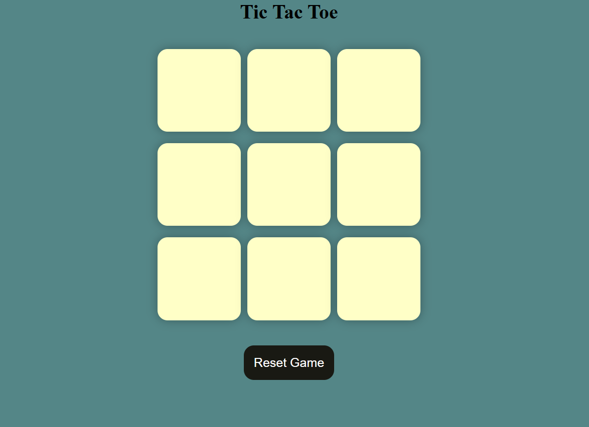

# Tic-Tac-Toe Game 🎲

A classic, browser-based Tic-Tac-Toe game built with plain HTML, CSS, and JavaScript. This project was created to practice fundamental front-end development skills, including DOM manipulation and game logic.

## ✨ Demo / Screenshot




## 🚀 Features

* **Classic Gameplay**: A 3x3 grid where two players can take turns marking spaces with 'X' and 'O'.
* **Turn Tracking**: The game clearly indicates whose turn it is.
* **Win Detection**: Automatically detects and announces a winner for all horizontal, vertical, and diagonal win conditions.
* **Draw Detection**: Declares a draw if all cells are filled and there is no winner.
* **Reset Game**: A simple button to reset the board and start a new game at any time.


## 💻 Technologies Used

* **HTML5**: For the structure and layout of the game board.
* **CSS3**: For styling the game board, cells, and messages.
* **JavaScript**: For all the game logic, including handling clicks, tracking turns, and determining the winner.


## 🔧 How to Play

To play the game locally, follow these simple steps:

1.  **Clone the repository:**
    ```bash
    git clone [https://github.com/kushagraTandon2609/TicTacToe-using-js.git](https://github.com/kushagraTandon2609/TicTacToe-using-js.git)
    ```
2.  **Navigate to the project directory:**
    ```bash
    cd TicTacToe-using-js
    ```
3.  **Open the `index.html` file** in your favorite web browser (like Chrome, Firefox, or Edge).

That's it! You can now play the game.